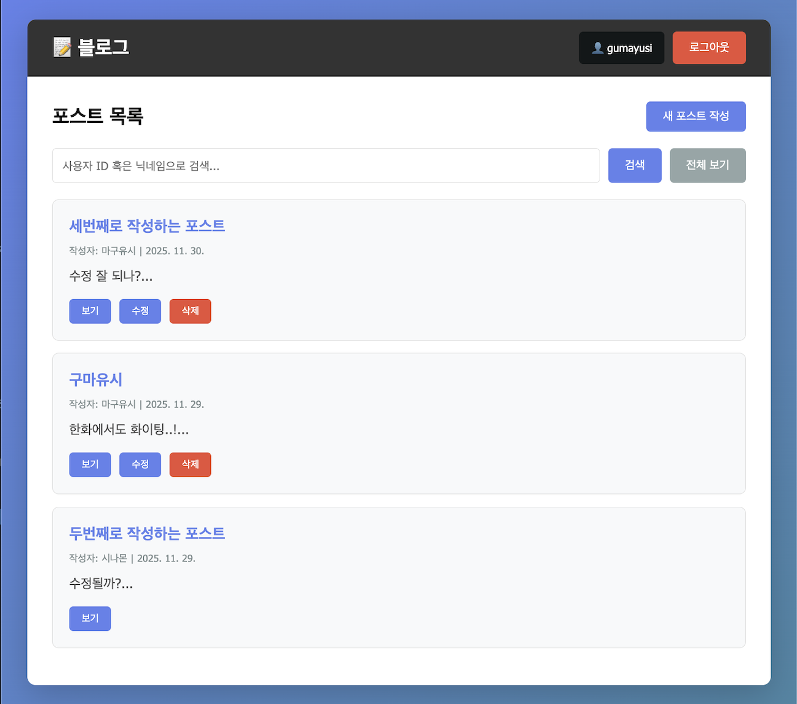
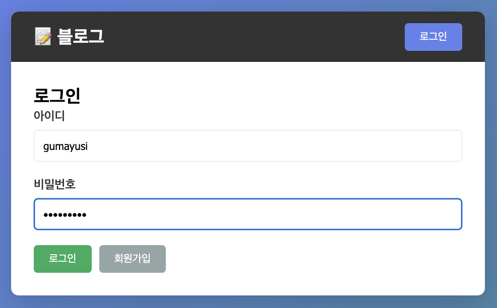
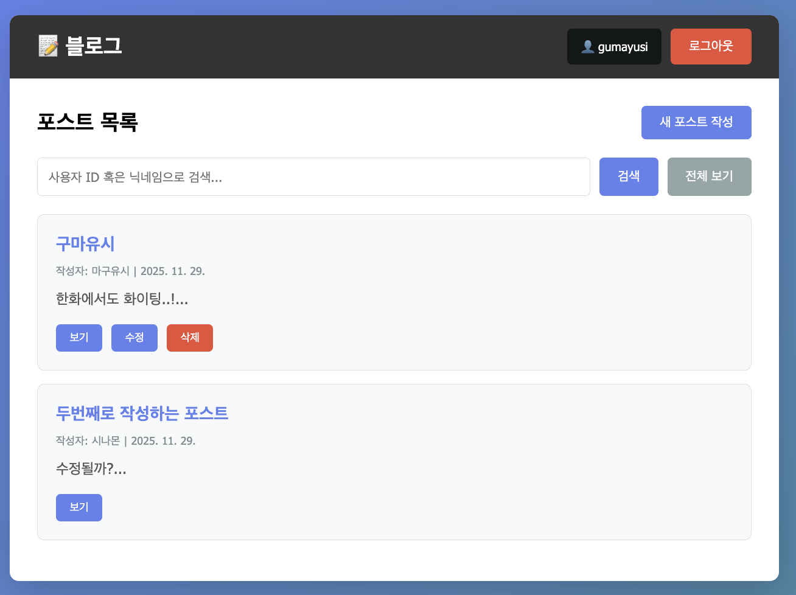
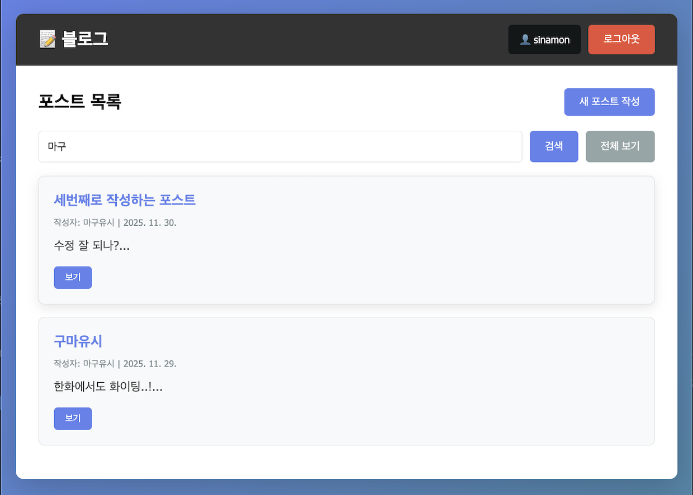
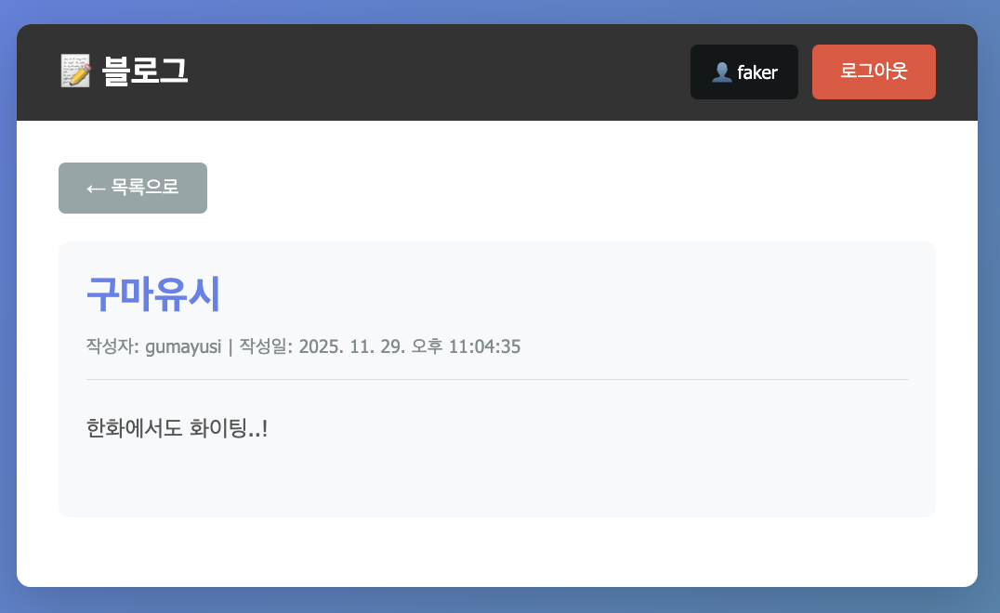
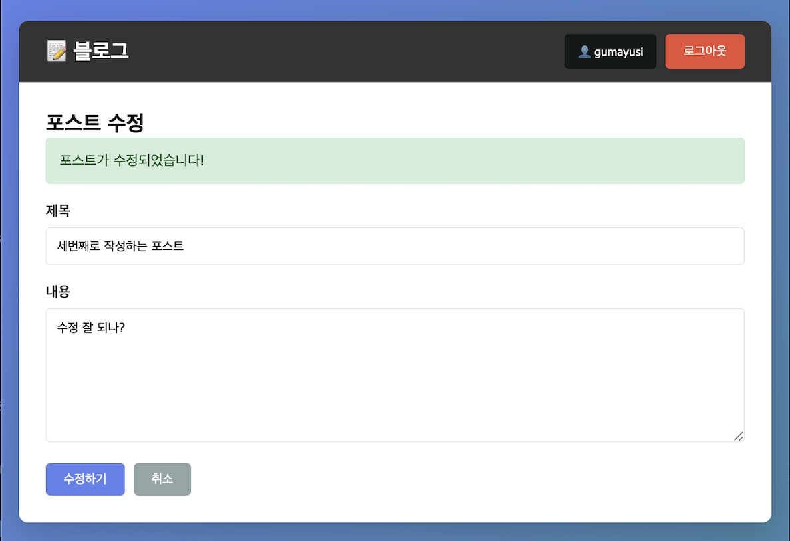

# 🎨 SimpleBoard Client

Vanilla JavaScript로 제작된 게시판 프론트엔드



## 🚀 주요 기능

- ✅ JWT 기반 로그인/회원가입
- ✅ 게시글 작성, 조회, 수정, 삭제
- ✅ 사용자 ID / 닉네임으로 게시글 검색
- ✅ 반응형 디자인
- ✅ ES6 모듈 시스템

## 📦 기술 스택

| 카테고리 | 기술 |
|---------|------|
| **언어** | Vanilla JavaScript (ES6+) |
| **모듈** | ES6 Modules |
| **스타일** | CSS3 |
| **API 통신** | Fetch API |

## 🛠️ 설치 및 실행

### 1️⃣ 사전 요구사항

- 웹 브라우저 (Chrome, Firefox, Safari 등)
- 백엔드 API 서버 실행 중이어야 함

### 2️⃣ 설치

```bash
# 저장소 클론
git clone https://github.com/LeF-0213/SimpleBoard_Client.git
cd SimpleBoard_Client
```

### 3️⃣ 백엔드 API URL 설정

`js/auth.js`, `js/posts.js`에서 API URL 확인:

```javascript
const API_URL = 'http://localhost:8080';  // 백엔드 서버 주소
```

백엔드 서버 주소가 다르면 수정하세요.

### 4️⃣ 실행

**방법 1: Live Server (VS Code)**
```bash
# VS Code에서 index.html 우클릭 → "Open with Live Server"
```

**방법 2: Python HTTP Server**
```bash
python -m http.server [포트번호]
# http://localhost:[포트번호] 접속
```

**방법 3: Node.js HTTP Server**
```bash
npx http-server -p [포트번호]
# http://localhost:[포트번호] 접속
```

## 🗂️ 프로젝트 구조

```
SimpleBoard_Client/
├── index.html               # 메인 HTML
├── css/
│   └── style.css           # 스타일시트
└── js/
    ├── app.js              # 메인 진입점 (모듈 통합)
    ├── auth.js             # 인증 관련 (회원가입/로그인)
    ├── posts.js            # 게시글 CRUD
    └── utils.js            # 공통 유틸리티 함수
```

## 📱 주요 화면

### 1️⃣ 로그인 / 회원가입




- 아이디 (4자 이상, 영문/숫자만)
- 비밀번호 (8자 이상)
- 닉네임
- 이메일

### 2️⃣ 게시글 목록



- 전체 게시글 조회
- 사용자 ID / 닉네임으로 검색
- 본인 게시글에만 수정/삭제 버튼 표시

### 3️⃣ 게시글 검색



- 사용자 ID 또는 닉네임으로 검색
- 실시간 검색 결과 표시

### 4️⃣ 게시글 상세



- 제목, 내용, 작성자, 작성일 표시
- 본인 게시글일 경우 수정/삭제 가능

### 5️⃣ 게시글 작성 / 수정



- 제목 (1자 이상)
- 내용 (4자 이상)

## 🔐 인증 흐름

```
1. 로그인 성공
   ↓
2. JWT 토큰을 localStorage에 저장
   ↓
3. 모든 API 요청에 Authorization 헤더 추가
   Authorization: Bearer {token}
   ↓
4. 로그아웃 시 localStorage에서 토큰 제거
```

## 📡 API 통신

### 인증 예시
```javascript
// 로그인
const response = await fetch('http://localhost:8080/auth/login', {
  method: 'POST',
  headers: { 'Content-Type': 'application/json' },
  body: JSON.stringify({ userid, password })
});
const { token, user } = await response.json();
localStorage.setItem('token', token);
```

### 게시글 조회 예시
```javascript
// JWT 토큰 포함
const token = localStorage.getItem('token');
const response = await fetch('http://localhost:8080/post', {
  headers: { 'Authorization': `Bearer ${token}` }
});
const posts = await response.json();
```

## 🎨 스타일

- 반응형 디자인 (모바일/태블릿/데스크톱)
- 그라디언트 배경
- 카드형 레이아웃
- 호버 효과 및 애니메이션

## 🔧 주요 함수

### auth.js
```javascript
handleSignup()      // 회원가입
handleLogin()       // 로그인
handleLogout()      // 로그아웃
checkAuth()         // 로그인 상태 확인
updateNavbar()      // 네비게이션 업데이트
```

### posts.js
```javascript
loadPosts()         // 게시글 목록 조회
handleCreatePost()  // 게시글 작성
viewPost(id)        // 게시글 상세 조회
editPost(id)        // 게시글 수정 페이지로 이동
handleUpdatePost()  // 게시글 수정 실행
deletePost(id)      // 게시글 삭제
handleSearch()      // 검색
```

### utils.js
```javascript
showPage(name)      // 페이지 전환
showMessage()       // 알림 메시지 표시
escapeHtml()        // XSS 방지용 HTML 이스케이프
```

## 🐛 문제 해결

### "Uncaught ReferenceError: handleLogin is not defined"
**원인:** ES6 모듈 사용 시 함수가 전역 스코프에 없음

**해결:** HTML에서 `type="module"` 확인
```html
<script type="module" src="./js/app.js"></script>
```

### "CORS 에러"
**원인:** 백엔드 서버에서 CORS 허용 안 됨

**해결:** 백엔드 `app.mjs`에 CORS 설정
```javascript
app.use(cors({ origin: "*" }));
```

### "로그인 후에도 포스트가 안 보임"
**원인:** JWT 토큰이 제대로 전달되지 않음

**해결:** 브라우저 개발자 도구(F12) → Application → Local Storage에서 `token` 확인

## 🔗 관련 저장소

- **백엔드 API**: [SimpleBoard_Server](https://github.com/LeF-0213/SimpleBoard_Server)

---

## 🚀 빠른 시작

```bash
# 1. 백엔드 서버 실행
cd SimpleBoard_Server
npm install
npm run dev

# 2. 프론트엔드 실행 (다른 터미널)
cd SimpleBoard_Client
python -m http.server [포트번호]

# 3. 브라우저에서 접속
# http://localhost:[포트번호]
```